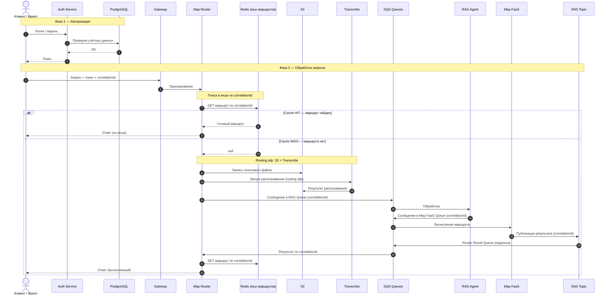
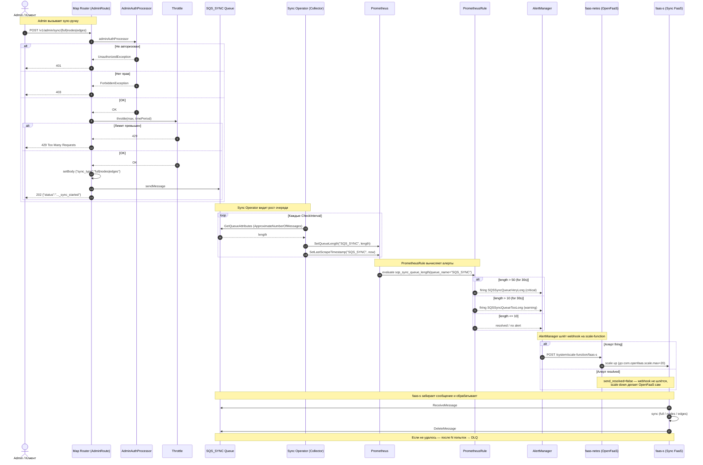
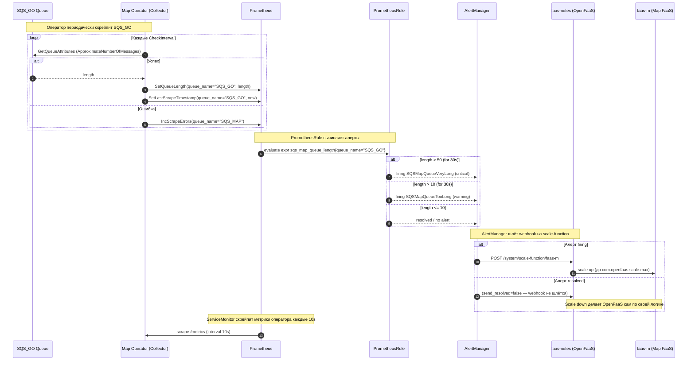

# Интеллектуальная система маршрутизации

Распределённая система для построения маршрутов и геопоиска.

## Основные компоненты

- RAG агент для распознавания в речи на естественном языке запросов, переводя их в JSON для поиска.
- Операторы для определения загрузки очередей. Чем больше сообщений в очереди, тем больше вызывается FaaS.
- FaaS для вычисления маршрутов и синхронизации баз данных.
- Маршрутизатор для направления запросов на обработку в AWS Transcribe, а затем на RAG агент, а также для получения сообщений и сохранения их в Redis.
- Сервис для авторизации и аутентификации.

## Поток обработки

## Масштабирование функций синхронизации

## Масштабирование функций вычисления маршрутов

## Технологический стек

| Компонент | Технология | Назначение |
|-----------|-----------|-----------|
| **Network** | Traefik, Cilium, Envoy | Политики сетей и шлюзы |
| **Auth Service** | Java 21, Spring Boot | Авторизация и аутентификация пользователей |
| **Map Router** | Java 21, Camel, Spring Boot | Маршрутизация запросов внутри системы |
| **RAG Agent** | Python, Llama 3.2 | Преобразование текста в параметры |
| **Map FaaS** | Go, OpenFaaS | Маршруты, Neo4j, OpenSearch, SNS |
| **Sync FaaS** | Go, OpenFaaS | Синхронизация Neo4j и OpenSearch |
| **Map Operator** | Go | Метрики для автоскейлинга Map FaaS |
| **Sync Operator** | Go | Метрики для автоскейлинга Sync FaaS |
| **Neo4j** | Neo4j 5 | Графовая БД |
| **OpenSearch** | OpenSearch 2.11.0 | Поисковая копия, KNN, нечеткий поиск |
| **Redis** | Redis 8 | Кеш результатов, статусы запросов |
| **Liquibase** | Liquibase | Миграции |
| **PostgreSQL** | PostgreSQL 16 | Хранение пользователей |
| **LocalStack** | LocalStack 4 | SQS, SNS, S3, Transcribe, Cloudformation (локальная разработка) |
| **OpenFaaS** | OpenFaaS | Платформа для FaaS(функций как сервис) |
| **Prometheus** | Prometheus | Сбор метрик |
| **AlertManager** | AlertManager | Алерты для автомасштабирования по длине очередей |
| **cAdvisor** | cAdvisor | Мониторинг нагрузки | 
| **Grafana stack** | Tempo, Alloy, Grafana, Loki | Визуализация и сохранение мониторинга |
| **Helm** | Helm | CD |
| **ArgoCD** | ArgoCD | CD |
| **Kubernetes** | KinD/K3s | Оркестрация |
| **Terraform** | Terraform 1.15.5 | Возможность развертывания ресурсов вне кластера |
| **Longhorn** | Longhorn | Менеджер томов, бекапы |
| **Karmada** | Karmada | Мультикластер |
| **kpack, Harbor** | kpack, Harbor | Сборка и реестр образов |
